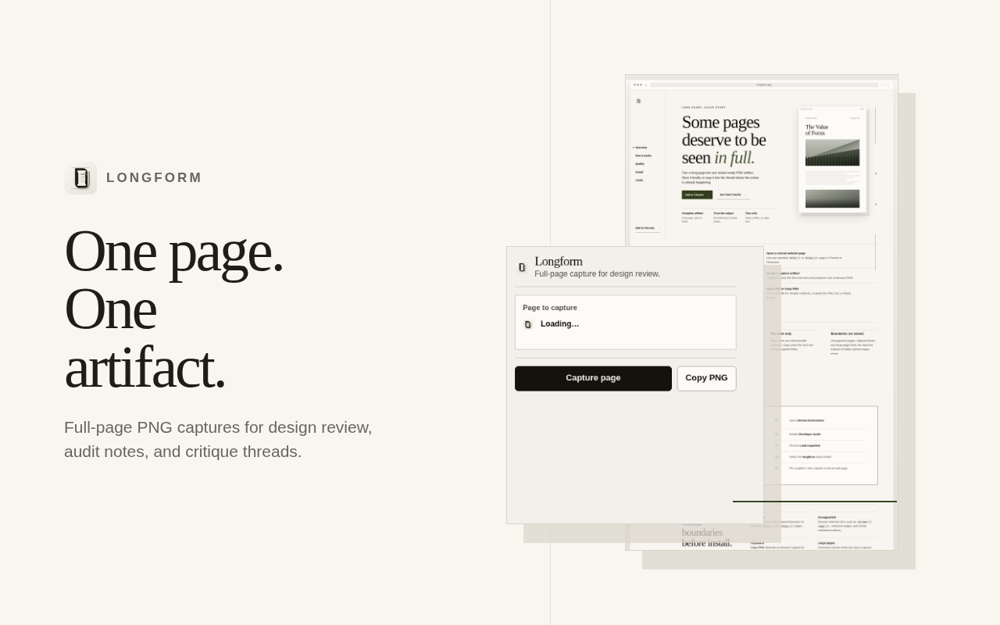
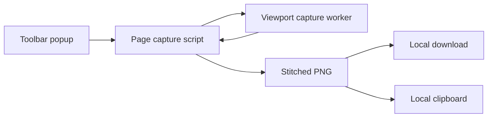

<p align="center">
  
</p>

<h1 align="center">Longform</h1>

<p align="center">
  Full-page PNG capture for design review in Chromium.
</p>

<p align="center">
  <a href="https://github.com/astrazds/longform/actions/workflows/ci.yml"></a>
  <a href="LICENSE"></a>
</p>

Longform is a focused Manifest V3 extension that turns a complete scrollable
page into one PNG. Save the artifact locally or copy it directly into a design
critique, QA note, or handoff thread.

<p align="center">
  
</p>

## Why Longform?

Viewport screenshots lose the relationship between a page's sections. Longform
keeps the full sequence together so layout, copy, and below-the-fold details can
be reviewed as one credible artifact. It also hides fixed, sticky, and scrollbar
chrome during capture to reduce repeated page furniture in the result.

## Install

Longform is currently distributed as an unpacked extension for Chrome and other
Chromium-based browsers.

1. Clone this repository:

   ```sh
   git clone https://github.com/astrazds/longform.git
   ```

2. Open `chrome://extensions` and enable **Developer mode**.
3. Choose **Load unpacked** and select the cloned `longform` directory.
4. Pin Longform, then open a normal `http://` or `https://` page.

## Use

1. Open the Longform toolbar popup on the page you want to review.
2. Choose **Save** to save a timestamped PNG.
3. Choose **Copy** instead when your browser supports writing image data to
   the clipboard. Keep the popup open until the copy finishes - the write runs
   from the popup during that click gesture.



The page-side script measures and scrolls the document, the service worker
captures each visible viewport, and the page-side canvas assembles the final
PNG before the requested local delivery.

## Privacy and permissions

Longform has no backend, analytics, advertising, telemetry, or remote code. It
does not collect or transmit page content, URLs, screenshots, browsing history,
or clipboard data. Captures remain on your device unless you choose to share
them elsewhere.

| Permission | Purpose |
| --- | --- |
| `activeTab` | Access the selected tab after you invoke the extension |
| `scripting` | Inject the capture script into that selected page |
| `clipboardWrite` | Copy the generated PNG when explicitly requested |

Longform does not request persistent access to all websites. See
[PRIVACY.md](PRIVACY.md) for the complete data boundary.

## Limitations

- Browser-internal pages such as `chrome://`, `edge://`, and extension pages
  cannot be captured.
- Very large pages can exceed Chromium canvas limits. Longform reports the
  boundary instead of saving a partial artifact.
- **Copy** writes from the extension popup during the click gesture, so
  host-page clipboard rules no longer apply. Keep the popup open until copy
  finishes. Delivery still depends on browser support for image clipboard
  writes, and very large PNGs may exceed extension messaging limits (use
  **Save** instead).
- The current installation path is manual. No Chrome Web Store release is
  published yet.

## Project structure

| Path | Purpose |
| --- | --- |
| `manifest.json`, `background.js`, `content.js`, `popup.*` | Extension entrypoints and popup |
| `protocol.js`, `capture*.js`, `clipboard.js` | Capture modules and shared contracts |
| `index.html`, `privacy.html`, `landing.css` | Static GitHub Pages site |
| `icons/` | Shared extension and site artwork |
| `docs/` | Product and visual-design context |
| `tests/fixtures/` | Eight browser capture regression pages |
| `scripts/` | Browser verification and release packaging |
| `webstore/` | Chrome Web Store copy and publication artwork |

## Development

`mise.toml` pins Node.js and defines the development commands.

```sh
mise install
mise run install
mise run browser:install
mise run check
mise run package:release
```

`mise run check` runs unit contracts, all eight capture fixtures, real toolbar
popup save and copy checks, and the packaged extension check. Run
`mise run test:popup` for focused delivery checks. Set `CHROMIUM_EXECUTABLE`
to use a specific browser; otherwise the scripts use a system Chromium or
Playwright's installed Chromium.

Read [the capture architecture](docs/architecture.md) for module ownership,
lifecycle contracts, and the checks to run for each change.

The release command creates `dist/longform-1.3.5.zip`. The archive contains
only the manifest, runtime files, popup files, and four PNG icons.

Contributions are welcome; read [CONTRIBUTING.md](CONTRIBUTING.md) before
opening a pull request. Longform is licensed under
[GPL-3.0-only](LICENSE).
