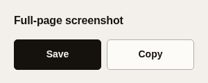

  

<h1 align="center">Longform</h1>

Capture the whole page. Save a PNG or copy it to your clipboard.

  
  

Longform is a free extension for Chrome and other Chromium-based browsers.
It scrolls the current web page and combines the captured viewports into one
PNG. Captures stay on your device.

  

## Install

Longform currently uses a manual installation. There is no published Chrome
Web Store release.

1. [Download Longform](https://github.com/astrazds/longform/archive/refs/heads/main.zip)
   and unzip it.
2. Open `chrome://extensions` and enable **Developer mode**.
3. Choose **Load unpacked** and select the extracted `longform-main` folder.

The extension loads directly from that folder. You do not need Node.js or a
build step to use it. Keep the folder in place while the extension is installed.

For the same setup instructions, see the
[landing page](https://astrazds.github.io/longform/).

## Use

Open a regular web page and click Longform in Chrome's extensions menu. Pin
Longform if you want its icon to stay in the toolbar.

- Choose **Save** to download a timestamped PNG.
- Choose **Copy** to put the PNG on your clipboard, then paste it into an app
  that accepts images.

Keep the popup open until it says **Saved.** or **Copied.** Both buttons are
disabled during capture. The page returns to its original scroll position
when capture finishes or fails. If copying fails, the popup explains how to
retry or save the screenshot instead.

## Limits

- Longform captures regular `http://` and `https://` pages. Browser settings,
  extension pages, and other restricted pages cannot be captured.
- Fixed and sticky elements are temporarily hidden during capture to avoid
  repeating them in the PNG. They are restored afterward.
- Very large pages can exceed the image-size limits. Longform reports a
  failure if the page is too large or it detects incomplete scroll coverage.
- Copy requires browser support for PNG clipboard writes. Large images can
  also exceed extension-message or clipboard limits. Use **Save** when Copy
  is unavailable.

## Privacy

Longform has no backend, analytics, advertising, telemetry, or remote code.
It does not send captures, page content, browsing history, or clipboard data
to the developer. You control where you share a saved or copied image.

The extension requests `activeTab`, `scripting`, and `clipboardWrite`.
It does not request persistent access to all websites. Read the
[privacy policy](PRIVACY.md) for the permission and data details.

## Development

Clone the repository for development. [CONTRIBUTING.md](CONTRIBUTING.md)
contains setup, verification, and package commands. `mise.toml` owns the tool
versions and common tasks.

Further documentation:

- [Architecture](docs/architecture.md) describes module ownership, capture
  delivery, and lifecycle contracts.
- [Product](docs/product.md) describes the current user flows and boundaries.
- [Design](docs/design.md) describes the popup, landing page, and visual rules.
- [Web Store listing draft](webstore/listing.md) contains submission copy and
  manual verification instructions.
- [Security policy](SECURITY.md) explains private vulnerability reporting.

Longform is licensed under [GPL-3.0-only](LICENSE).
